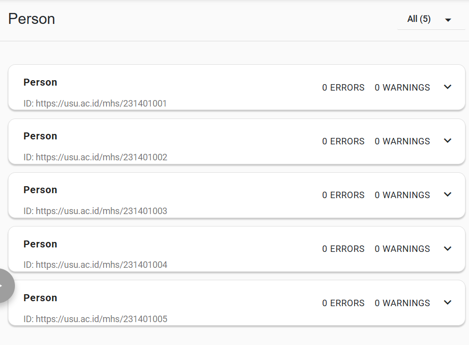
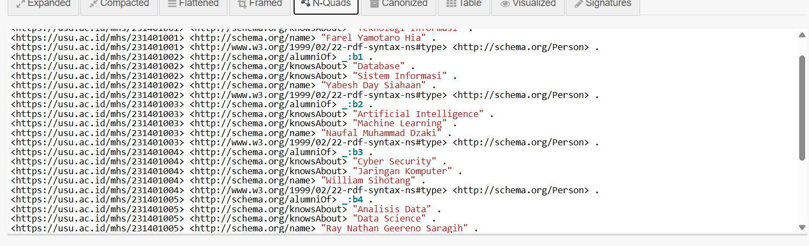
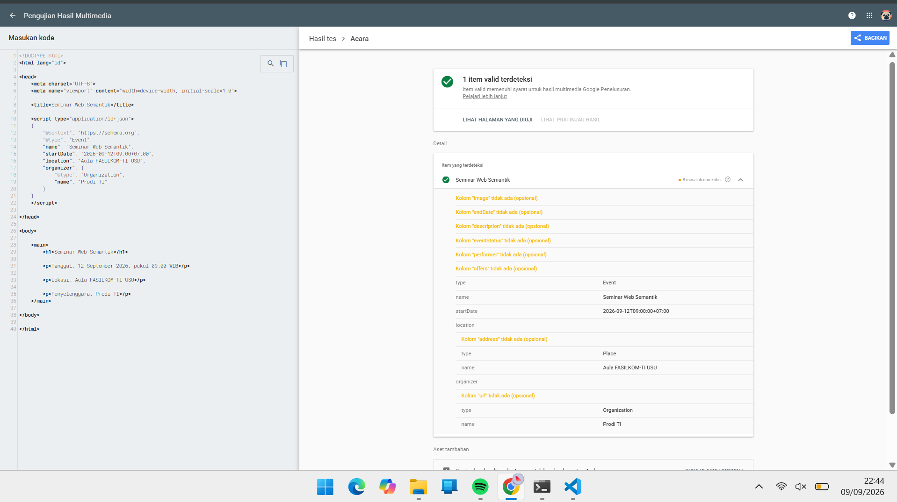

# [Latihan Pertemuan 3](README.md) - JSON-LD dan Structured Data

## Identitas
| No. | Nama                       |       NIM |
| --: | -------------------------- | --------: |
|   1 | Farel Yamotaro Hia         | 251402069 |
|   2 | Ray Nathan Geereno Saragih | 251402046 |
|   3 | Naufal Muhammad Dzaki      | 251402128 |
|   4 | William Fransisco Sihotang | 251402052 |
|   5 | Yabesh Day Siahaan         | 251402004 |

## Struktur Hasil
- [`profil_saya.jsonld`](profil_saya.jsonld)
- [`profil_perbaikan.jsonld`](profil_perbaikan.jsonld)
- [`seminar.html`](seminar.html)
- folder [`screenshots`](screenshots/)

## 1. JSON Biasa dan JSON-LD

### A. JSON Biasa

JSON (JavaScript Object Notation) digunakan untuk menyimpan dan bertukar data dalam format yang sederhana dan mudah dibaca oleh manusia maupun mesin.

Contoh:

```json
{
  "nama": "Ida Dadi",
  "pekerjaan": "Dosen"
}
```

Pada JSON biasa, informasi hanya disimpan sebagai pasangan **key-value**. Data `"nama"` berisi `"Ida Dadi"` dan `"pekerjaan"` berisi `"Dosen"`.

Namun, JSON biasa tidak menjelaskan secara eksplisit **apa makna atau konteks** dari setiap data tersebut. Sistem lain hanya mengetahui bahwa terdapat sebuah field bernama `nama` dan `pekerjaan`, tetapi tidak memiliki informasi standar mengenai arti dari field tersebut.

---

### B. JSON-LD

JSON-LD (**JavaScript Object Notation for Linked Data**) merupakan format JSON yang memungkinkan data memiliki **konteks dan makna semantik** sehingga dapat dipahami secara lebih baik oleh mesin.

Contoh:

```json
{
  "@context": "https://schema.org",
  "@type": "Person",
  "@id": "https://usu.ac.id/dosen/idadi",
  "name": "Ida Dadi",
  "jobTitle": "Dosen"
}
```
---

### 1. Perbedaan fungsi kunci:
#### Jawaban: 
Kalau **JSON biasa**, pasangan `"nama"` dan `"pekerjaan"` merupakan nama properti yang dibuat oleh pengembang sesuai kebutuhan aplikasi. Maknanya hanya dapat dipahami berdasarkan struktur atau dokumentasi dari sistem yang menggunakannya.

Sedangkan kalau **JSON-LD**, `"name"` dan `"jobTitle"` merupakan properti yang memiliki makna semantik berdasarkan vocabulary yang ditentukan oleh `@context`, yaitu **Schema.org**. Dengan demikian, mesin dapat memahami bahwa `"name"` menunjukkan nama suatu entitas dan `"jobTitle"` menunjukkan jabatan atau pekerjaan entitas tersebut.

*Kesimpulannya:* `nama`/`pekerjaan` hanya merupakan field JSON biasa, sedangkan `name`/`jobTitle` memiliki makna yang terstandarisasi dalam konteks Linked Data.

---
### 2. Fungsi `@context`, `@type`, dan `@id`:
#### Jawaban:


Nah, tiga ini properti tersebut merupakan bagian penting dari **JSON-LD**:
* **`@context`**
  Berfungsi untuk menentukan **konteks atau vocabulary** yang digunakan dalam dokumen JSON-LD. Pada contoh ini:
  ```json
  "@context": "https://schema.org"
  ```
  Artinya, istilah seperti `Person`, `name`, dan `jobTitle` mengacu pada vocabulary yang didefinisikan oleh **Schema.org**.

* **`@type`**
  Berfungsi untuk menentukan **tipe atau jenis entitas** yang direpresentasikan oleh sebuah node. Contohnya:
  ```json
  "@type": "Person"
  ```
  menunjukkan bahwa node tersebut merepresentasikan sebuah **Person (orang)**.

* **`@id`**
  Berfungsi sebagai **identitas unik** untuk sebuah node atau entitas. Contohnya:
  ```json
  "@id": "https://usu.ac.id/dosen/idadi"
  ```
  memberikan identifier berupa URI sehingga entitas tersebut dapat dikenali dan dirujuk secara konsisten oleh sistem lain.

---
### 3. Node tanpa `@id`:
#### Jawaban:

Jika sebuah node JSON-LD tidak memiliki `@id`, node tersebut tetap dapat diproses dan memiliki makna berdasarkan `@type` serta properti lainnya. Namun, node tersebut **tidak memiliki identifier global yang eksplisit**.

Akibatnya, node tersebut lebih sulit untuk dirujuk secara unik dari dokumen atau dataset lain. Jika terdapat beberapa node dengan informasi yang sama atau serupa, sistem juga tidak memiliki `@id` sebagai penanda eksplisit untuk membedakan atau menghubungkan node tersebut.

Sebagai contoh, node berikut tidak memiliki `@id`:

```json
{
  "@context": "https://schema.org",
  "@type": "Person",
  "name": "Ida Dadi",
  "jobTitle": "Dosen"
}
```

Node tersebut tetap dikenali sebagai `Person`, tetapi tidak mempunyai identifier global seperti:

```json
"@id": "https://usu.ac.id/dosen/idadi"
```

**Kesimpulannya:** `@id` tidak selalu wajib agar sebuah node dapat memiliki makna, tetapi keberadaannya penting untuk memberikan **identitas yang dapat dirujuk dan dihubungkan** dengan data lain dalam ekosistem Linked Data.

---

## 2. Pemeriksaan schema.org

Disini dilakukan pemeriksaan kosakata **Schema.org** untuk menentukan tipe dan properti yang sesuai untuk entitas mahasiswa dan universitas.

### 1. Tabel Pemeriksaan Kosakata

| Entitas | Tipe yang Dipakai | Properti yang Diperiksa |
|---|---|---|
| Mahasiswa | `Person` | `name`, `alumniOf`, `knowsAbout` |
| Universitas | `CollegeOrUniversity` | `name` |
| Mata Kuliah | `Course` | `name`, `description`, `provider` |
| Organisasi | `Organization` | `name`, `url`, `member` |
| Institusi Pendidikan | `EducationalOrganization` | `name`, `url`, `address` |

### Penjelasan

- Mahasiswa

Mahasiswa direpresentasikan menggunakan tipe: `Person`
Tipe `Person` digunakan untuk merepresentasikan seseorang. Beberapa properti
yang digunakan adalah `name`, `alumniOf`, dan `knowsAbout`.

- Universitas

Universitas direpresentasikan menggunakan tipe: `CollegeOrUniversity`
Tipe `CollegeOrUniversity` digunakan untuk merepresentasikan institusi
pendidikan tinggi seperti universitas atau perguruan tinggi.

- Mata Kuliah

Mata kuliah direpresentasikan menggunakan tipe: `Course`
Tipe `Course` digunakan untuk merepresentasikan sebuah mata kuliah atau
program pembelajaran. Properti yang dapat digunakan antara lain `name`,
`description`, dan `provider`.

- Organisasi

Organisasi direpresentasikan menggunakan tipe: `Organization`
Tipe `Organization` digunakan untuk merepresentasikan sebuah organisasi.
Properti yang dapat digunakan antara lain `name`, `url`, dan `member`.

- Institusi Pendidikan

Institusi pendidikan direpresentasikan menggunakan tipe: `EducationalOrganization`
Tipe `EducationalOrganization` digunakan untuk merepresentasikan organisasi
yang bergerak di bidang pendidikan. Properti yang dapat digunakan antara lain
`name`, `url`, dan `address`.

---

### 1. Mengapa tipe yang paling spesifik dan masih tepat sebaiknya dipilih?

Tipe yang paling spesifik dan masih sesuai sebaiknya dipilih agar informasi yang diberikan lebih akurat dan memiliki makna yang jelas. Dengan menggunakan tipe yang tepat, mesin atau aplikasi dapat lebih mudah memahami konteks dari suatu entitas.
Contohnya, mahasiswa menggunakan tipe `Person` karena mahasiswa merupakan seseorang. Sedangkan universitas menggunakan `CollegeOrUniversity` karena tipe tersebut lebih spesifik untuk merepresentasikan perguruan tinggi.
Jadi, pemilihan tipe yang spesifik dapat membuat data lebih terstruktur, jelas, dan mudah dipahami oleh mesin.

---

### 2. Mengapa nama properti mengikuti Schema.org, sedangkan nilainya boleh berbahasa Indonesia?

Nama properti harus mengikuti Schema.org agar dapat dikenali dan dipahami oleh mesin berdasarkan vocabulary atau standar yang sudah ditentukan.

Contohnya:

```json
"name": "Budi Santoso"
```
Pada contoh tersebut, `name` merupakan nama properti yang mengikuti Schema.org, sedangkan `"Budi Santoso"` merupakan nilai yang dapat menggunakan bahasa Indonesia.

Contoh lainnya:

```json
"knowsAbout": [
  "Pemrograman",
  "Basis Data",
  "Jaringan Komputer"
]
```

Nama properti `knowsAbout` tetap menggunakan vocabulary Schema.org, tetapi nilai di dalamnya dapat ditulis dalam bahasa Indonesia.
Dengan demikian, penggunaan properti Schema.org menjaga struktur dan makna data agar dapat dipahami mesin, sedangkan nilai dapat disesuaikan dengan bahasa yang digunakan oleh pengguna.

---

### 3. Apa manfaat array pada `knowsAbout`?

Array pada `knowsAbout` digunakan ketika seseorang memiliki lebih dari satu bidang atau topik yang diketahui atau dikuasai.

Contoh:

```json
"knowsAbout": [
  "Pemrograman",
  "Basis Data",
  "Jaringan Komputer"
]
```

Pada contoh tersebut, seorang mahasiswa memiliki tiga bidang pengetahuan, yaitu:
1. Pemrograman
2. Basis Data
3. Jaringan Komputer

Dengan menggunakan array, beberapa nilai dapat disimpan dalam satu properti `knowsAbout`.
Hal ini membuat data menjadi lebih lengkap, fleksibel, dan terstruktur.

---

### 4. Contoh JSON-LD

Berikut contoh penerapan tipe dan properti tersebut dalam JSON-LD:

```json
{
  "@context": "https://schema.org",
  "@type": "Person",
  "name": "Budi Santoso",
  "alumniOf": {
    "@type": "CollegeOrUniversity",
    "name": "Universitas Indonesia"
  },
  "knowsAbout": [
    "Pemrograman",
    "Basis Data",
    "Jaringan Komputer"
  ]
}
```

Pada contoh di atas:
- `@type: Person` menunjukkan bahwa data tersebut merepresentasikan seseorang.
- `name` berisi nama mahasiswa.
- `alumniOf` menunjukkan universitas tempat mahasiswa menjadi alumni.
- `@type: CollegeOrUniversity` menunjukkan bahwa institusi tersebut merupakan perguruan tinggi.
- `knowsAbout` berisi beberapa bidang yang diketahui atau dikuasai oleh mahasiswa.

---

### 5. Referensi Schema.org

- [Person](https://schema.org/Person)
- [CollegeOrUniversity](https://schema.org/CollegeOrUniversity)
- [alumniOf](https://schema.org/alumniOf)
- [knowsAbout](https://schema.org/knowsAbout)

---

## 3. Perbaikan Lima Kesalahan
# Perbaikan profil_perbaikan.jsonld

| No | Kesalahan | Sebelum | Sesudah | Penjelasan |
|----|-----------|---------|---------|------------|
| 1 | Huruf besar/kecil pada tipe | `"@type": "person"` | `"@type": "Person"` | Tipe schema.org bersifat *case-sensitive* dan harus diawali huruf kapital, sesuai vocabulary resmi (`Person`, bukan `person`). |
| 2 | Jenis tanda kutip | `'name': "Rina Anggraini"` | `"name": "Rina Anggraini"` | JSON hanya mengizinkan tanda kutip ganda (`"`) untuk key maupun string. Tanda kutip tunggal (`'`) membuat JSON tidak valid. |
| 3 | Format tanggal bukan ISO 8601 | `"birthDate": "12 September 2004"` | `"birthDate": "2004-09-12"` | Properti tanggal pada schema.org harus mengikuti format ISO 8601 (`YYYY-MM-DD`) agar dapat dibaca mesin secara konsisten. |
| 4 | Properti tidak terdaftar di schema.org | `"nomorInduk": "221401001"` | `"identifier": "221401001"` | `nomorInduk` bukan properti resmi schema.org. Diganti dengan `identifier`, properti standar untuk menyimpan nomor pengenal seperti NIM/NIP. |
| 5 | Koma menggantung pada properti terakhir | `"nomorInduk": "221401001",` (diikuti `}`) | `"identifier": "221401001"` (tanpa koma sebelum `}`) | Trailing comma tidak diperbolehkan dalam JSON standar; koma setelah properti terakhir menyebabkan parsing error. |

## 4. Triple dari JSON-LD Playground
Tuliskan satu baris N-Quads yang terbentuk:

```text
<https://usu.ac.id/mhs/251402069> <http://schema.org/name> "Farel Yamotaro Hia" .
```

## 5. Hasil Validasi
- Schema Markup Validator:
  5 entitas `Person` terdeteksi dengan:
  - 0 errors
  - 0 warnings

- Rich Results Test:
  Hasil pengujian `seminar.html`:
  - 1 valid item detected
  - Tipe: `Events`
  - Eligible for Google Search's rich results
  - 8 non-critical issues detected
    Peringatan:
    - Missing field `offers` (optional)
    - Missing field `endDate` (optional)
    - Missing field `description` (optional)
    - Missing field `eventStatus` (optional)
    - Missing field `performer` (optional)
    - Missing field `image` (optional)
    - Missing field `address` (optional)
    - Missing field `url` (optional)
  
- JSON-LD Playground:
  JSON-LD berhasil dikonversi menjadi format N-Quads dan menghasilkan triple RDF.

## 6. Refleksi
1. Mengapa `@context` disebut jembatan menuju makna?
   Jawaban : @context disebut jembatan menuju makna karena @context menghubungkan istilah yang digunakan dalam JSON-LD dengan kosakata yang memiliki makna yang jelas, seperti Schema.org. Dengan adanya @context, komputer dapat memahami bahwa istilah seperti Person, name, atau knowsAbout memiliki arti tertentu, bukan sekadar teks biasa.
   
2. Apa perbedaan fungsi Schema Markup Validator dan Rich Results Test?
   Jawaban : Schema Markup Validator digunakan untuk memeriksa apakah struktur dan penggunaan tipe serta properti dalam structured data sudah sesuai dengan kosakata Schema.org.
   Sedangkan Rich Results Test digunakan untuk memeriksa apakah structured data pada suatu halaman memenuhi persyaratan agar berpotensi ditampilkan sebagai rich result di Google.
   Jadi, Schema Markup Validator fokus pada kebenaran markup, sedangkan Rich Results Test fokus pada kelayakan untuk fitur hasil kaya Google.
   
3. Mengapa isi JSON-LD harus sama dengan konten yang terlihat pada halaman?
   Jawaban : Karena JSON-LD berfungsi untuk memberikan informasi terstruktur tentang konten halaman. Jika informasi dalam JSON-LD berbeda atau tidak sesuai dengan apa yang terlihat oleh pengguna, mesin pencari dapat menganggap data tersebut menyesatkan atau tidak merepresentasikan isi halaman dengan benar. Contohnya, jika JSON-LD menyatakan seminar berlangsung pada 12 September 2026, maka informasi tanggal yang terlihat di halaman juga harus menunjukkan tanggal tersebut. Dengan begitu, structured data benar-benar merepresentasikan konten halaman.

## Bukti



