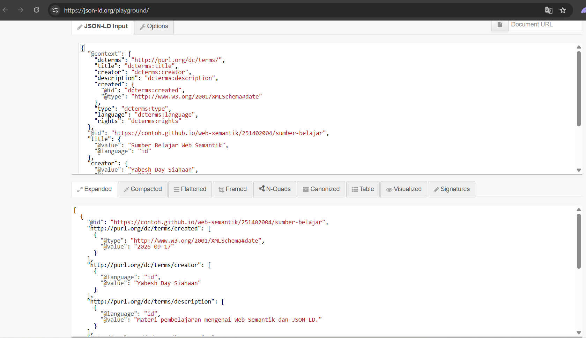
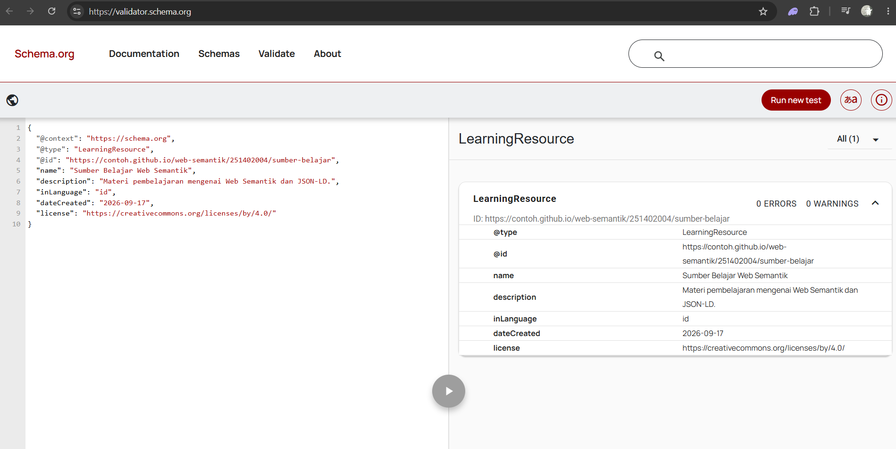

# [Pertemuan 4](README.md) — Metadata dan Interoperabilitas

## Identitas sumber
- Judul: [PEMANFAATAN TEKNOLOGI WEB SEMATIK DALAM
PENCARIAN INFORMASI BERBASIS E-LEARNING](https://ejournal.unama.ac.id/index.php/processor/article/download/239/160/1193)
- Pembuat: [Hendri, S.Kom, M.S.I](https://www.researchgate.net/profile/Hendri-Hendri)
- URI sumber: [http://example.org](http://example.org)
- Jenis sumber: [Jurnal Ilmiah / Artikel Jurnal (Journal Article)](https://ejournal.unama.ac.id/index.php/processor/article/download/239/160/1193)

---

### Tabel Format
| Elemen | Yang Diisi | Isi |
|--------|------------|---------------------------------------------------------------------------------|
| Judul | Nama sumber | PEMANFAATAN TEKNOLOGI WEB SEMATIK DALAM PENCARIAN INFORMASI BERBASIS E-LEARNING |
| Pembuat | Orang atau organisasi | Hendri, S.Kom, M.S.I |
| Deskripsi | Ringkasan 1–2 kalimat | Pembelajaran melalui suatu media teknologi informasi dan komunikasi atau yang dikenal Elearning merupakan sistem yang sedang berkembang di Indonesia. Sistem elearning yang ada saat ini masih menggunakan konsep website pencarian yang berdasarkan kata kunci sehingga aplikasi website Elearning yang ada tidak dapat menampilkan lebih jauh tentang konten pendukung yang memiliki kesamaan konteks dengan konteks yang sedang dipelajarinya. |
| Tanggal | Tanggal terbit atau pembaruan, ISO 8601 | 2014-10 |
| Jenis | Bentuk sumber | e-journal |
| Bahasa | Kode bahasa | id |
| Hak | Pernyataan lisensi/hak | Creative Commons Attribution 4.0 International License |

---

## Pemetaan Dublin Core Terms
| Properti | Nilai | Alasan pemilihan |
| --- | --- | --- |
| dcterms:title | Pemanfaatan Teknologi Web Sematik Dalam Pencarian Informasi Berbasis E-Learning | Karena sebagai pengenal dasar akademis tentang jurnal |
| dcterms:creator | Hendri, S.Kom, M.S.I | Karena sebagai pengenal dasar akademis tentang jurnal |
| dcterms:description | Pembelajaran melalui suatu media teknologi informasi dan komunikasi atau yang dikenal Elearning merupakan sistem yang sedang berkembang di Indonesia. Sistem elearning yang ada saat ini masih menggunakan konsep website pencarian yang berdasarkan kata kunci sehingga aplikasi website Elearning yang ada tidak dapat menampilkan lebih jauh tentang konten pendukung yang memiliki kesamaan konteks dengan konteks yang sedang dipelajarinya. | Karena menyimpan intisari (abstrak) |
| dcterms:created | 2014-10 |  Karena sebagai pengenal dasar akademis tentang jurnal |
| dcterms:type | Text | Karena dapat mendefinisikan bentuk konten |
| dcterms:language | id | Karena dapat mendefinisikan bentuk bahasa dokumen |
| dcterms:rights | Creative Commons Attribution 4.0 International License | Karena sebagai kejelasan aspek hukum bahwa aset Linked Data ini berlisensi terbuka dan dapat didistribusikan ulang secara bebas |
| dcterms:identifier | ISSN 1907-6738 | Karena sebagai pencatat orisinalitas dokumen yang mengaitkannya langsung ke serial cetak ISSN Jurnal Media Processor |
| dcterms:source | Jurnal Ilmiah Media Processor Vol.9 No.3 | Karena sebagai pencatat orisinalitas dokumen yang mengaitkannya langsung ke serial cetak ISSN Jurnal Media Processor |
| dcterms:publisher | Universitas Dinamika Bangsa | Sebagai perujuk pada organisasi institusional |
| dcterms:subject | Web semantic, E-learning | Karena menyimpan kata kunci taksonomi objek data untuk pencarian berbasis konteks |

***Catatan*** : Didasarkan pada standar minimum pencatatan metadata bibliografi artikel ilmiah agar dapat diolah secara cerdas dalam grafik pengetahuan (Knowledge Graph) merupakan alasan umum penggunaan properti, Di dalam dokumentasi data kami ini, dcterms:creator merujuk pada entitas intelektual utama yang memikirkan serta menulis artikel ilmiahnya, yaitu peneliti individu bernama Hendri, S.Kom, M.S.I. Dan sisi lain, dcterms:publisher merujuk pada organisasi institusional, yakni Universitas Dinamika Bangsa, selaku badan hukum yang menerbitkan, mendistribusikan, serta menyebarluaskan karya tersebut melalui wadah jurnal ilmiahnya.

---

## Hasil validasi
### 
- [JSON-LD Playground](screenshots/jsonld-playground.png) : JSON-LD berhasil diproses tanpa galat sintaks. Hasil pemrosesan menunjukkan bahwa URI subjek yang digunakan adalah `https://f-comand02.github.io/web-semantik-kelompok06/pertemuan-04/sumber-belajar`, sama seperti URI pada metadata Turtle. Data seperti judul, pembuat, deskripsi, tanggal, bahasa, dan hak juga berhasil ditampilkan sebagai RDF.
### 
- [Schema Markup Validator](screenshots/schema-validator.png) : Metadata Schema.org telah disusun menggunakan vocabulary Schema.org dan URI yang sama dengan metadata Turtle dan JSON-LD. Hasil validasi menunjukkan bahwa data dapat diproses oleh Schema Markup Validator.
- Tabel Perbandingan

| Elemen     | HTML Meta      | Turtle                | JSON-LD                               | Makna                                                                            |
| ---------- | -------------- | --------------------- | ------------------------------------- | -------------------------------------------------------------------------------- |
| Judul      | `DC.title`     | `dcterms:title`       | `title` → `dcterms:title`             | Tidak berubah                                                                    |
| Pembuat    | `DC.creator`   | `dcterms:creator`     | `creator` → `dcterms:creator`         | Tidak berubah                                                                    |
| Deskripsi  | `description`  | `dcterms:description` | `description` → `dcterms:description` | Tidak berubah                                                                    |
| Tanggal    | `DC.date`      | `dcterms:created`     | `created` → `dcterms:created`         | Tidak berubah secara informasi, tetapi istilah berubah dari date menjadi created |
| Bahasa     | `DC.language`  | `dcterms:language`    | `language` → `dcterms:language`       | Tidak berubah                                                                    |
| Hak        | `DC.rights`    | `dcterms:rights`      | `rights` → `dcterms:rights`           | Tidak berubah                                                                    |
| Jenis      | `DC.type`      | `dcterms:type`        | `type` → `dcterms:type`               | Tidak berubah                                                                    |
| Identifier | Tidak tersedia | `dcterms:identifier`  | `identifier` → `dcterms:identifier`   | Tidak berubah, tetapi hanya ada di Turtle dan JSON-LD                            |
| Sumber     | Tidak tersedia | `dcterms:source`      | `source` → `dcterms:source`           | Tidak berubah, tetapi hanya ada di Turtle dan JSON-LD                            |
| Penerbit   | Tidak tersedia | `dcterms:publisher`   | `publisher` → `dcterms:publisher`     | Tidak berubah, tetapi hanya ada di Turtle dan JSON-LD                            |
| Subjek     | Tidak tersedia | `dcterms:subject`     | `subject` → `dcterms:subject`         | Tidak berubah, tetapi hanya ada di Turtle dan JSON-LD                            |

---

## Refleksi

1. Mengapa URI yang sama penting untuk Turtle dan JSON-LD?

   URI yang sama penting karena digunakan untuk menunjukkan bahwa metadata dalam format Turtle dan JSON-LD mengacu pada resource yang sama. Meskipun format penulisannya berbeda, URI yang sama memungkinkan aplikasi atau sistem lain menghubungkan kedua metadata tersebut sebagai deskripsi dari sumber yang sama.

2. Apa perbedaan peran DC Terms dan schema.org pada pekerjaan ini?

   DC Terms digunakan sebagai vocabulary untuk mendeskripsikan metadata sumber, seperti judul, pembuat, deskripsi, tanggal, bahasa, hak, dan informasi lainnya. Sementara itu, schema.org digunakan untuk memberikan struktur metadata yang dapat dipahami oleh berbagai aplikasi dan mesin pencari di web. Keduanya menggunakan vocabulary yang berbeda, tetapi dapat digunakan untuk mendeskripsikan resource yang sama.

3. Sebutkan satu risiko jika metadata HTML, Turtle, dan JSON-LD tidak konsisten.

   Jika metadata HTML, Turtle, dan JSON-LD tidak konsisten, aplikasi dapat memperoleh informasi yang berbeda dari sumber yang sebenarnya sama. Hal tersebut dapat menyebabkan resource sulit dikenali atau dihubungkan dengan benar sehingga interoperabilitas metadata terganggu.

---

## Catatan akhir
Metadata pada HTML, Turtle, dan JSON-LD telah dibuat konsisten dengan menggunakan URI yang sama serta informasi sumber yang sama, seperti judul, pembuat, deskripsi, tanggal, bahasa, dan hak. Meskipun setiap format menggunakan sintaks dan vocabulary yang berbeda, ketiganya tetap mengacu pada resource yang sama sehingga dapat mendukung interoperabilitas metadata.
