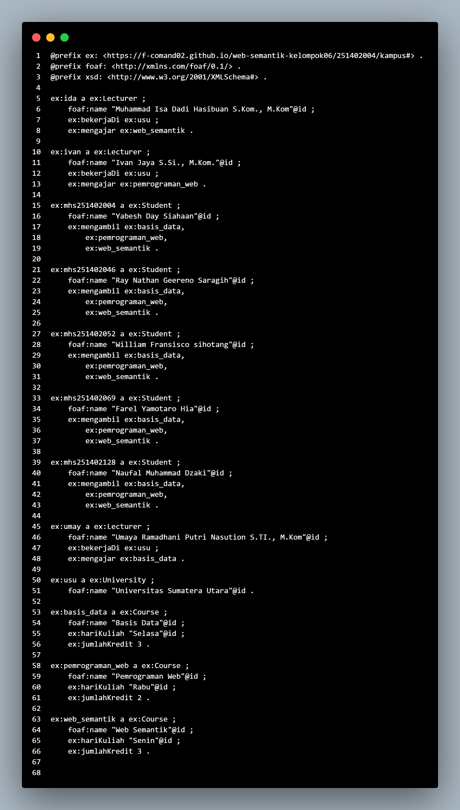

# [Pertemuan 6](README.md) - RDF Dasar

---

## IRI dasar graf
[http://example.org/](https://f-comand02.github.io/web-semantik-kelompok06/251402004/kampus#)
- https://f-comand02.github.io/web-semantik-kelompok06/251402004/kampus#

---

## Ringkasan graf
- Jumlah triple: 3
- Namespace yang digunakan: 
  - ex: <http://example.org/>
  - rdf: <http://www.w3.org/1999/02/22-rdf-syntax-ns#>
- Entitas: ex:ida (Ida Adi), ex:Lecturer (kelas dosen), ex:WebSemantik (mata kuliah Web Semantik)

---

## Contoh triple
1. [ex:ida] - [rdf:type] - [ex:Lecturer]
2. [ex:ida] - [ex:teaches] - [ex:WebSemantik]
3. [ex:WebSemantik] - [ex:name] - ["Web Semantik"]

---

### Format Tabel

| No | Subject | Predicate | Object |
|----|---------|-----------|--------|
| 1 | ex:ida | rdf:type | ex:Lecturer |
| 2 | ex:ida | ex:teaches | ex:WebSemantik |
| 3 | ex:WebSemantik | ex:name | "Web Semantik" |

---

## Pertanyaan

### RDF Dasar: IRI, Literal, Blank Node, dan Prefix

### IRI Dasar Graf

`http://example.org/`
`https://f-comand02.github.io/web-semantik-kelompok06/251402004/kampus#`

---

#### 1. Identifikasi jenis node untuk `ex:ida`, `"Ida Adi"@id`, dan `[ ex:kota "Medan" ]`

##### Pertanyaan

Identifikasi jenis node untuk:

- `ex:ida`
- `"Ida Adi"@id`
- `[ ex:kota "Medan" ]`

##### Jawaban

| Node | Jenis Node | Penjelasan |
|---|---|---|
| `ex:ida` | **IRI** | `ex:ida` merupakan resource yang memiliki identitas berupa IRI. |
| `"Ida Adi"@id` | **Literal** | Merupakan nilai berupa teks/string. |
| `[ ex:kota "Medan" ]` | **Blank Node** | Merupakan node anonim yang tidak memiliki IRI secara langsung. |

##### Penjelasan

##### 1. `ex:ida` → IRI

`ex:ida` ini merupakan **IRI (Internationalized Resource Identifier)**, karena dia mengidentifikasi sebuah resource secara unik.

Contoh:

```turtle
ex:ida
```

##### 2. `"Ida Adi"@id` → Literal

Kalau `"Ida Adi"@id` merupakan **Literal**, yaitu nilai yang berisi data berupa teks.

Contoh literal lainnya:

```turtle
"Ida Adi"
"Medan"
"Web Semantik"
```

##### 3. `[ ex:kota "Medan" ]` → Blank Node

Selanjutnya `[ ex:kota "Medan" ]` merupakan **Blank Node**, karena node tersebut tidak mempunyai nama atau IRI yang ditentukan secara langsung.

Contoh:

```turtle
[
    ex:kota "Medan"
]
```

Jadi, kesimpulannya:

```text
ex:ida                  → IRI
"Ida Adi"@id            → Literal
[ ex:kota "Medan" ]     → Blank Node
```

---

#### 2. Mengapa literal tidak boleh menjadi subject RDF?

##### Pertanyaan

Mengapa literal tidak boleh menjadi subject RDF?

##### Jawaban

Menurut kami literal tidak boleh menjadi **subject** dalam RDF karena literal digunakan untuk menyimpan **nilai atau data**, bukan untuk mengidentifikasi suatu resource.

Dalam RDF, sebuah triple memiliki bentuk:

```text
Subject → Predicate → Object
```

Subject hanya dapat berupa:

- **IRI**
- **Blank Node**

Sedangkan **Literal hanya dapat digunakan sebagai Object**.

##### Contoh yang benar

```turtle
ex:ida ex:nama "Ida Adi" .
```

Penjelasannya:

| Bagian | Nilai | Jenis |
|---|---|---|
| Subject | `ex:ida` | IRI |
| Predicate | `ex:nama` | IRI |
| Object | `"Ida Adi"` | Literal |

##### Contoh yang salah

```turtle
"Ida Adi" ex:nama ex:ida .
```

Contoh tersebut salah karena `"Ida Adi"` merupakan literal dan digunakan sebagai **subject**.

##### Kesimpulan

Nah, literal tidak boleh menjadi subject karena literal hanya merepresentasikan **nilai/data**, sedangkan subject harus merepresentasikan **resource atau entitas** yang dapat memiliki hubungan dengan resource lainnya.

---

#### 3. Buat IRI dasar untuk graf Anda dengan pola HTTP

##### Pertanyaan

Buat IRI dasar untuk graf Anda dengan pola HTTP, misalnya:

```text
https://f-comand02.github.io/web-semantik-kelompok06/251402004/kampus#
```

##### Jawaban

IRI dasar yang digunakan untuk graf adalah:

```text
https://f-comand02.github.io/web-semantik-kelompok06/251402004/kampus#
```

IRI tersebut dapat digunakan sebagai namespace `ex`:

```turtle
@prefix ex: <https://f-comand02.github.io/web-semantik-kelompok06/251402004/kampus#> .
```

Dengan menggunakan prefix tersebut, penulisan IRI menjadi lebih singkat.

Contohnya:

```turtle
ex:ida
ex:Lecturer
ex:WebSemantik
ex:teaches
ex:name
```

daripada harus menulis IRI lengkap setiap kali di pakai.

##### Contoh RDF/Turtle

```turtle
@prefix ex: <https://f-comand02.github.io/web-semantik-kelompok06/251402004/kampus#> .
@prefix rdf: <http://www.w3.org/1999/02/22-rdf-syntax-ns#> .

ex:ida rdf:type ex:Lecturer .
ex:ida ex:teaches ex:WebSemantik .
ex:WebSemantik ex:name "Web Semantik" .
```

##### Penjelasan Triple

Triple pertama:

```turtle
ex:ida rdf:type ex:Lecturer .
```

Artinya `ex:ida` merupakan seorang `ex:Lecturer`.

Triple kedua:

```turtle
ex:ida ex:teaches ex:WebSemantik .
```

Artinya `ex:ida` mengajar mata kuliah `ex:WebSemantik`.

Triple ketiga:

```turtle
ex:WebSemantik ex:name "Web Semantik" .
```

Artinya nama dari `ex:WebSemantik` adalah `"Web Semantik"`.

---

#### 4. Tuliskan kepanjangan namespace `rdf`, `rdfs`, `xsd`, dan `foaf`

##### Pertanyaan

Tuliskan kepanjangan namespace:

- `rdf`
- `rdfs`
- `xsd`
- `foaf`

##### Jawaban

| Prefix | Kepanjangan | Namespace |
|---|---|---|
| `rdf` | Resource(Sumber Daya) Description Framework | `http://www.w3.org/1999/02/22-rdf-syntax-ns#` |
| `rdfs` | RDF Schema | `http://www.w3.org/2000/01/rdf-schema#` |
| `xsd` | XML Schema Definition | `http://www.w3.org/2001/XMLSchema#` |
| `foaf` | Friend of a Friend | `http://xmlns.com/foaf/0.1/` |

##### 1. RDF

**RDF** merupakan singkatan dari **Resource Description Framework**.

Namespace:

```text
http://www.w3.org/1999/02/22-rdf-syntax-ns#
```

Contoh penggunaan:

```turtle
@prefix rdf: <http://www.w3.org/1999/02/22-rdf-syntax-ns#> .
```

Contoh:

```turtle
ex:ida rdf:type ex:Lecturer .
```

---

##### 2. RDFS

**RDFS** merupakan singkatan dari **RDF Schema**.

Namespace:

```text
http://www.w3.org/2000/01/rdf-schema#
```

Contoh penggunaan:

```turtle
@prefix rdfs: <http://www.w3.org/2000/01/rdf-schema#> .
```

---

##### 3. XSD

**XSD** merupakan singkatan dari **XML Schema Definition**.

Namespace:

```text
http://www.w3.org/2001/XMLSchema#
```

XSD digunakan untuk menentukan tipe data literal, misalnya:

```turtle
"20"^^xsd:integer
```

Contoh penggunaan:

```turtle
@prefix xsd: <http://www.w3.org/2001/XMLSchema#> .
```

---

##### 4. FOAF

**FOAF** merupakan singkatan dari **Friend of a Friend**.

Namespace:

```text
http://xmlns.com/foaf/0.1/
```

FOAF digunakan untuk mendeskripsikan informasi mengenai orang dan hubungan antarorang.

Contoh penggunaan:

```turtle
@prefix foaf: <http://xmlns.com/foaf/0.1/> .
```

---

## Perbandingan serialisasi

- **[Turtle](screenshots/output-turtle.png)**: Lebih ringkas dan mudah dibaca karena menggunakan prefix `ex` dan `foaf`. Triple untuk setiap entitas dikelompokkan, dan literal bahasa serta tipe data ditulis langsung, misalnya `"Senin"@id` dan `3` sebagai integer.


- **[JSON-LD](https://github.com/user-attachments/assets/a2ec1afb-7dab-44c0-8162-26e6dca2bd03)**
: Struktur lebih panjang dan eksplisit. URI ditulis lengkap, sementara entitas dan properti ditampilkan dengan `@id`, `@type`, dan array. Bahasa dan tipe data literal dinyatakan dengan `@language` dan `@type`.
- **Pernyataan yang sama**: Kedua format merepresentasikan graf RDF yang sama. Contohnya, Ray Nathan Geereno Saragih adalah mahasiswa dan mengambil Web Semantik, Basis Data, serta Pemrograman Web. Perbedaan urutan atau bentuk penulisan tidak mengubah maknanya.

---

## Refleksi

### 1. Kapan object harus berupa IRI dan kapan berupa literal?

Nah kalau object berupa IRI ketika menyatakan hubungan/relasi antara dua resource yang masing-masing punya identitas sendiri dan bisa diberi properti tambahan, misalnya `ex:ida ex:mengajar ex:web_semantik` (baik dosen maupun mata kuliah adalah resource yang bisa dirujuk kembali dan dideskripsikan lebih lanjut).
Object berupa literal ketika menyatakan nilai data konkret yang deskriptif dan tidak perlu dirujuk sebagai resource tersendiri, misalnya `foaf:name "Muhammad Isa..."` atau `ex:jumlahKredit 3` (nama dan jumlah SKS adalah nilai akhir/atomic, bukan entitas yang punya relasi lain).

### 2. Mengapa Prefix Membantu Keterbacaan Tanpa Mengubah IRI

Prefix (seperti `ex:` atau `foaf:`) hanyalah singkatan tampilan (*syntactic sugar*), bukan bagian dari identitas data sebenarnya.
### IRI Sesungguhnya Tetap Utuh
Ketika kita menulis:

```python
g.bind("ex", EX)
```

IRI `https://f-comand02.github.io/web-semantik-kelompok06/251402004/kampus#ida` tidak berubah menjadi apa pun yang lain. Fungsi `bind()` hanya memberi tahu serializer (misalnya saat memanggil `g.serialize(format="turtle")`) bahwa setiap kali muncul IRI berawalan `https://f-comand02.github.io/web-semantik-kelompok06/251402004/kampus#`, tampilkan sebagai `ex:` di file `.ttl`.

### Contoh Perbandingan

Tanpa prefix (IRI panjang ditulis berulang):
```turtle
<https://f-comand02.github.io/web-semantik-kelompok06/251402004/kampus#ida>
    a <https://f-comand02.github.io/web-semantik-kelompok06/251402004/kampus#Lacturer> ;
    <http://xmlns.com/foaf/0.1/name> "Muhammad Isa Dadi Hasibuan, S.Kom., M.Kom" .
```

Dengan prefix (ringkas dan mudah dibaca manusia):
```turtle
ex:ida a ex:Lecturer ;
    foaf:name "Muhammad Isa Dadi Hasibuan, S.Kom., M.Kom" .
```

Kesimpulan: `ex:ida` dan `<https://f-comand02.github.io/web-semantik-kelompok06/251402004/kampus#ida>` merujuk ke resource yang persis sama. Parser RDF akan mengekspansi `ex:ida` kembali menjadi IRI lengkapnya saat membaca file. Prefix hanya memengaruhi bagaimana IRI ditulis/dibaca oleh manusia, sama sekali tidak memengaruhi identitas resource dalam graf — IRI penuh tetap menjadi kunci sebenarnya.

### 3 . Sebutkan satu kesalahan pemodelan yang Anda hindari pada graf ini.

Kami punya Kesalahan yang dihindari yaitu tidak menjadikan literal sebagai subject. Misalnya, nilai `"Web Semantik"` (nama mata kuliah) atau angka `3` (jumlah SKS) tidak pernah dijadikan subject dari triple lain, keduanya selalu diposisikan sebagai object, sementara yang menjadi subject adalah resource ber-IRI seperti `ex:web_semantik`. Selain itu, jumlah SKS dimodelkan dengan tipe data yang benar (`xsd:integer`) alih-alih sebagai string biasa, sehingga makna datanya tetap konsisten dan bisa diproses/divalidasi secara semantik oleh aplikasi lain.

---
